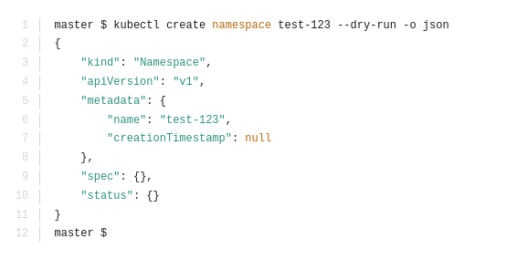
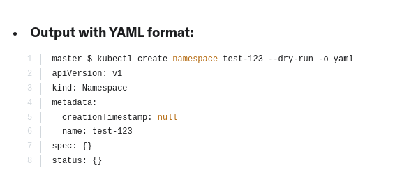
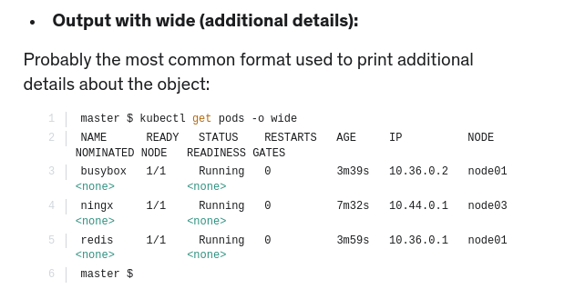

Certification Tip: Formatting Output with kubectl
                                                                       

The default output format for all kubectl commands is the human-readable plain-text format.

The -o flag allows us to output the details in several different formats.

kubectl [command] [TYPE] [NAME] -o <output_format>

Here are some of the commonly used formats:

-o jsonOutput a JSON formatted API object.

-o namePrint only the resource name and nothing else.

-o wideOutput in the plain-text format with any additional information.

-o yamlOutput a YAML formatted API object.

Here are some useful examples:

Output with JSON format:

For more details, refer:

https://kubernetes.io/docs/reference/kubectl/overview/

https://kubernetes.io/docs/reference/kubectl/cheatsheet/